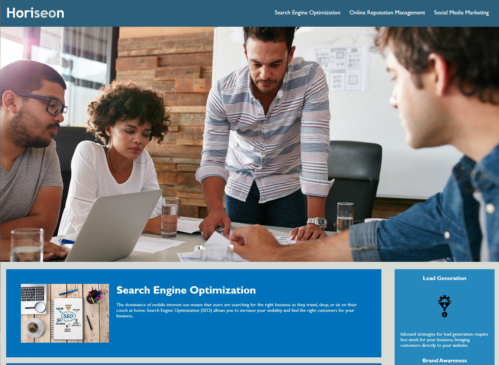

# Optimizing Code to Meet Accessibility Standards

## Description

A marketing agency contracted us to refactor their source code to meet accessibility standards so their site is optimized for search engines. Alt text was added to images, the title of the page was changed to better explain the company in general, and links were repaired.

## Usage

Use this webpage to navigate how Horiseon can help you optimize your search engine results.
https://nooburger81.github.io/Challenge1-Refactoring/

## License

Please refer to license information contained in repository.
